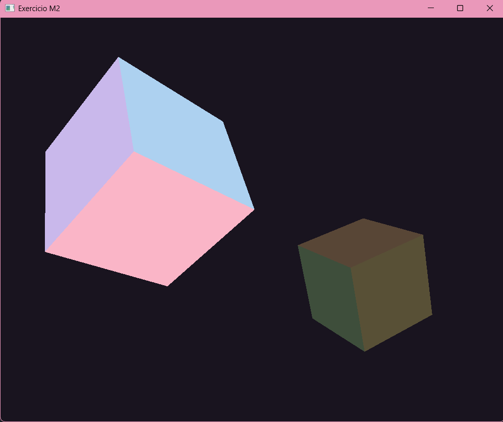

# Exercício do Módulo 2 - Cubo 3D com transformações

Trabalho da disciplina de Computação Gráfica (Unisinos).

Partindo do projeto base, que tinha uma pirâmide, trocamos a geometria por um
cubo montado a partir de triângulos, com uma cor diferente em cada face.
A cena tem dois cubos e é possível escolher um deles para aplicar rotação,
translação e escala pelo teclado.



## O que foi implementado

- Geometria do cubo escrita à mão: 8 cantos, 6 faces, 2 triângulos por face
  (12 triângulos, 36 vértices no buffer)
- Uma cor pastel por face, para dar noção de profundidade sem iluminação
- Rotação nos eixos X, Y e Z
- Translação nos 3 eixos
- Escala uniforme
- Dois cubos na cena, guardados num `vector<Object3D>`
- TAB alterna qual cubo recebe as transformações (o outro fica escurecido)

Os dois cubos compartilham o mesmo VAO, já que a geometria é a mesma. O que
diferencia um do outro é a matriz de modelo, montada na ordem
escala → rotação → translação.

## Como compilar e rodar

Precisa de CMake e um compilador C++. Usamos o MSYS2 com o VS Code no Windows.

```bash
git clone <link-do-repositorio>
cd <pasta-do-projeto>
cmake -S . -B build
cmake --build build
```

O CMake baixa a GLFW e a GLM sozinho.

Para rodar, entre na pasta `build`:

```bash
cd build
./Exercicio_M2        # no Windows: .\Exercicio_M2.exe
```

## Controles

| Tecla     | O que faz                                  |
| --------- | ------------------------------------------ |
| X / Y / Z | rotaciona no eixo correspondente           |
| A / D     | translada no eixo X (esquerda / direita)   |
| W / S     | translada no eixo Z (afasta / aproxima)    |
| I / J     | translada no eixo Y (sobe / desce)         |
| K / L     | escala uniforme (diminui / aumenta)        |
| TAB       | alterna o cubo selecionado                 |
| Espaço    | volta a cena para o estado inicial         |
| P         | alterna entre malha preenchida e wireframe |
| ESC       | fecha o programa                           |

Começa com o primeiro cubo selecionado. O cubo não selecionado aparece
escurecido.

Sobre o K e o L: o enunciado sugeria `[` e `]`, mas o GLFW reporta a posição
física da tecla usando o layout americano como referência. Em teclado ABNT2
essas posições não correspondem aos caracteres impressos, então trocamos por
duas teclas que ficam no mesmo lugar nos dois layouts.

## Referências

- [GLFW Input Guide](https://www.glfw.org/docs/latest/input_guide.html)
- Documentação da GLM para as matrizes de transformação

---

Alunas: Eduarda Fernandes e Maria Eduarda Dias
